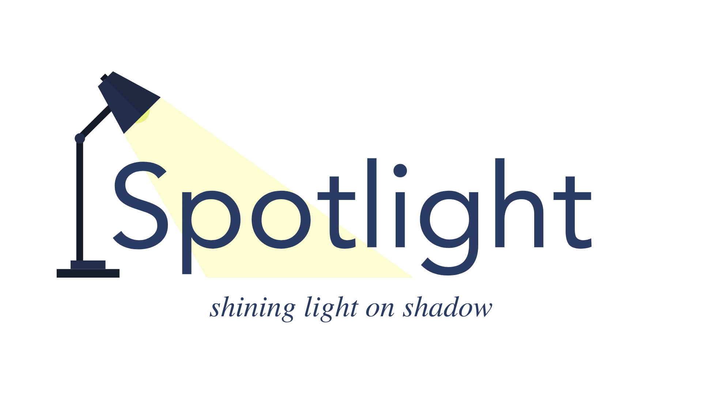
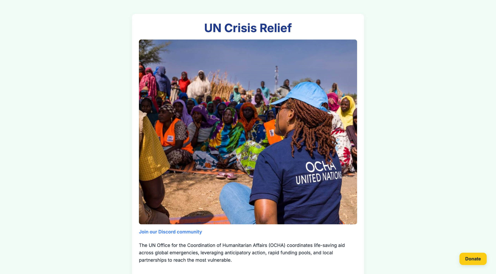
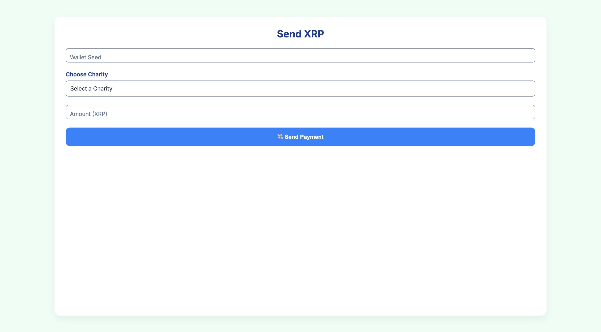
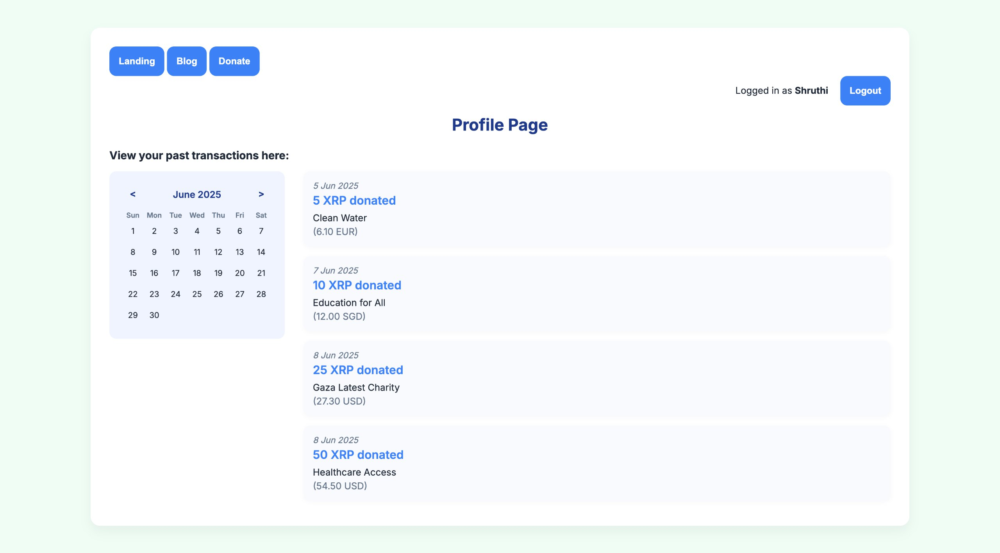

# Spotlight

Every dollar counts. Shining light in pockets of shadows.

## Who are we?

Spotlight is a transparent, XRP-driven charity pooling platform that enables people to donate to grassroots causes with minimal fees and maximum transparency.

## Problem

Grassroots charities in Southeast Asia often get left behind due to:

1. High cross-border transaction and currency exchange costs
2. Limited access to global fundraising tools
3. Lack of trust, visibility, or infrastructure

Meanwhile, student donors in developed countries:

1. Want to support meaningful causes
2. Often donate small amounts ($5–$20)
3. Face significant friction in sending funds abroad (e.g., 10–30% loss in fees)

## Main Features

### 1. XRP Ledger

When people make cross-border transactions, Banks or card providers add Foreign Exchange (FX) mark ups in the form of conversion markups or cross-border surcharges.

Spotlight trades directly through XRP Ledgers, which is a fast and extremely low-cost cross-border payment alternative that cost only ~$0.0002 per transaction.

### 2. Charity Pooling

Many payment provider charge a flat processing fee per transaction. Spotlight pools charities together based on regions or causes. to allow users to comfortably contribute to a cause of their interest. Every dollar counts, and spotlight aims to make every dollar worthwhile.

### 3. Transparency

Spotlight has a tracking feature that allows users to track exactly where every cent that they donated went and how it has been spent.

Transparency is spotlight's number 1 priority as a trustworthy and reliable fundraising platform for small charities.

---

## Tech Stack
1. **Version Control:** Git & GitHub  
2. **Frontend:**  
   - Markup & Styles: HTML, CSS  
   - Interactivity: JavaScript (Fetch API)  
3. **Backend:**  
   - Framework: Python + Flask  
   - CORS support: Flask-CORS  
   - XRP integration: xrpl-py  
4. **External API:**  
   - XRPL Testnet via JSON-RPC (`https://s.altnet.rippletest.net:51234`)  

---

## Screenshots

## Screenshots

### Landing Page

### Blog Page

### Donation Page

### Profile Page

---

## Screen Recording
https://drive.google.com/drive/folders/1NcHAt6N5RUIzRZKxm_b30VN1ly0wcqzL?usp=share_link
